# CountRep — Current Architecture

> This document describes the current architecture of CountRep.
>
> CountRep is an offline-first workout tracking application built with Vue 3, TypeScript, Fastify and PostgreSQL.

---

## 1. Architectural Overview

CountRep follows an **offline-first architecture**.

The frontend considers IndexedDB as the primary local persistence layer. Network communication with the backend is used to synchronize local data with the server.

The general architecture is:

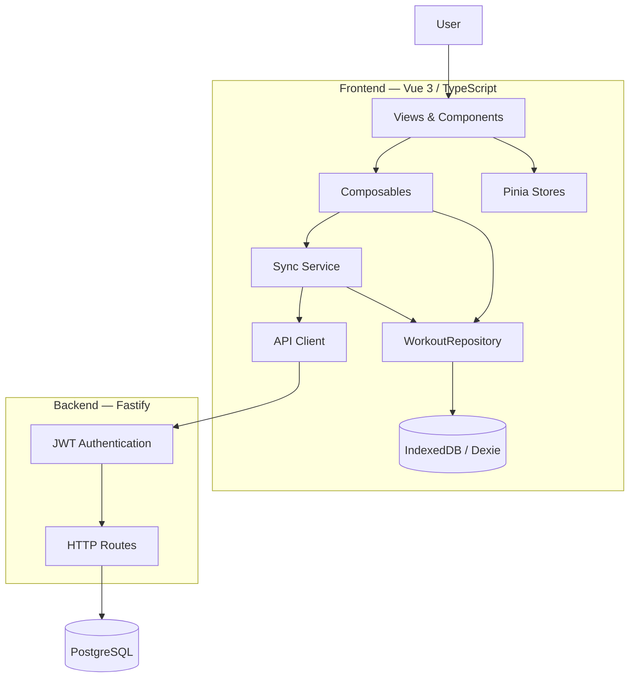

The important architectural principle is:

> **Local persistence comes before network synchronization.**

---

# 2. Frontend Structure

The current frontend structure is:

```text
frontend/src/

├── api/
│   └── workouts.ts
│
├── components/
│   └── ExerciseSelector.vue
│
├── composables/
│   └── useWorkouts.ts
│
├── db.ts
├── exercises.ts
│
├── repositories/
│   └── workoutRepository.ts
│
├── services/
│   └── sync.ts
│
├── stores/
│   ├── auth.ts
│   └── exercise.ts
│
└── views/
    └── TodayView.vue
```

The main responsibilities are currently distributed as follows:

| Layer        | Responsibility                                |
| ------------ | --------------------------------------------- |
| Views        | UI orchestration and user interactions        |
| Components   | Reusable UI components                        |
| Composables  | Application state and use cases               |
| Stores       | Global client-side state                      |
| Repository   | Local persistence abstraction                 |
| Sync Service | Synchronization between local and remote data |
| API          | HTTP communication                            |
| DB           | IndexedDB / Dexie configuration               |

---

# 3. `TodayView.vue`

`TodayView.vue` is currently the main workout entry point.

It is responsible for:

* displaying the calendar;
* navigating between months;
* selecting a date;
* displaying daily repetition totals;
* displaying the exercise selector;
* opening the workout modal;
* handling repetition input;
* creating a workout through `useWorkouts`.

The component interacts with the application through:

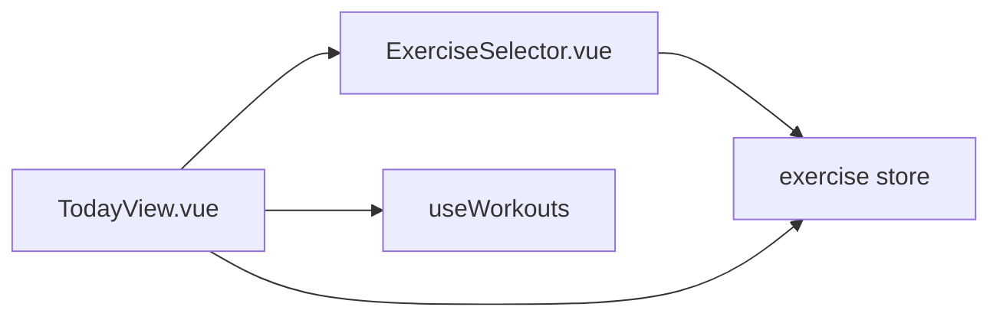

The view does **not** directly access IndexedDB.

This is an important separation:

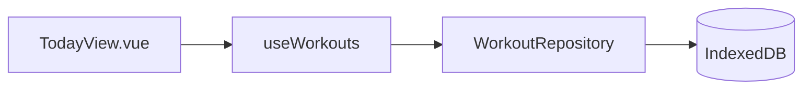

---

# 4. Exercise Selection

Exercise selection is currently handled by the `exercise` Pinia store.

```text
stores/exercise.ts
```

The selected exercise is persisted in `localStorage`.

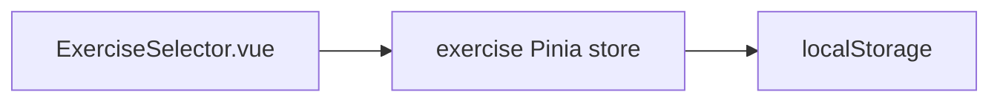

The available exercises are currently defined in:

```text
exercises.ts
```

The store contains:

```ts
selectedExercise: string | null
```

---

# 5. Authentication

Authentication state is handled by:

```text
stores/auth.ts
```

The JWT token is persisted in `localStorage`.

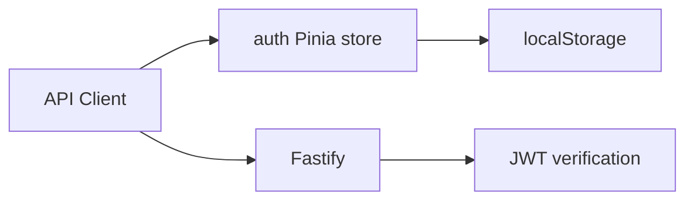

The frontend sends the token using:

```http
Authorization: Bearer <token>
```

The backend extracts the authenticated user's ID from the JWT.

The client therefore does not choose the owner of a workout.

---

# 6. Local Persistence

IndexedDB is the local persistence layer.

Dexie is used as the IndexedDB abstraction.

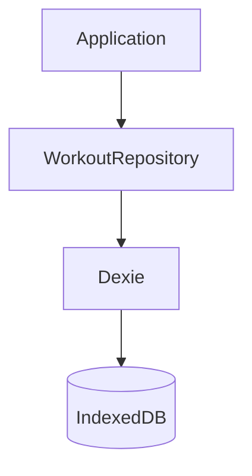

The database is currently named:

```text
WorkoutDatabase
```

It contains:

```text
workouts
syncState
```

---

# 7. Workout Repository

The repository provides an abstraction over IndexedDB.

File:

```text
repositories/workoutRepository.ts
```

Current operations include:

```ts
getAll()
create()
update()
getPending()
saveSynced()
```

The repository is deliberately unaware of Vue components.

Its responsibility is limited to local persistence.

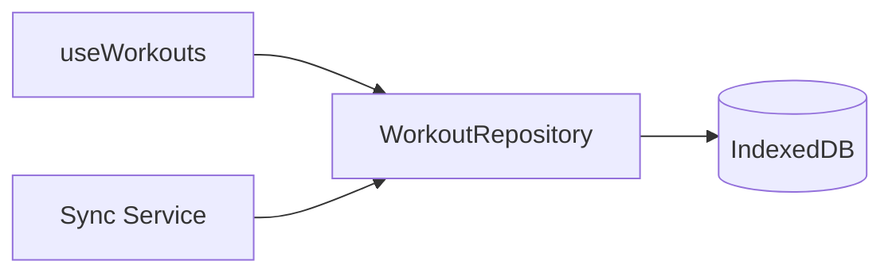

This creates the following boundary:

> Application code should interact with local workout data through the repository rather than directly through Dexie.

---

# 8. Local Workout Model

The current local representation is:

```ts
interface LocalWorkout {
  id: string
  exercise: string
  date: string
  reps: number
  mode: 'add' | 'set'
  createdAt: number
  updatedAt: number
  deletedAt?: number | null
  syncStatus: 'pending' | 'synced'
}
```

The `syncStatus` property is local synchronization metadata.

Possible values are:

```text
pending
synced
```

The model therefore combines:

1. workout data;
2. local synchronization state.

---

# 9. Workout Creation Flow

Creating a workout follows the offline-first principle.

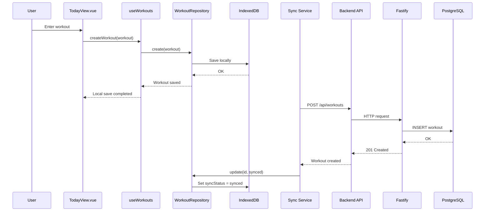

The local save does not depend on network availability.

---

# 10. Offline Behavior

When the application is offline, the workout is still stored locally.

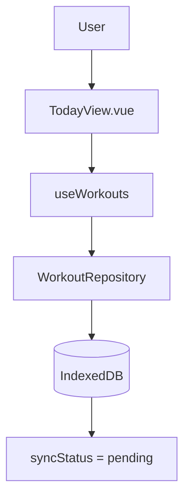

The network request may fail, but the local data remains available.

When connectivity returns, pending workouts are synchronized.

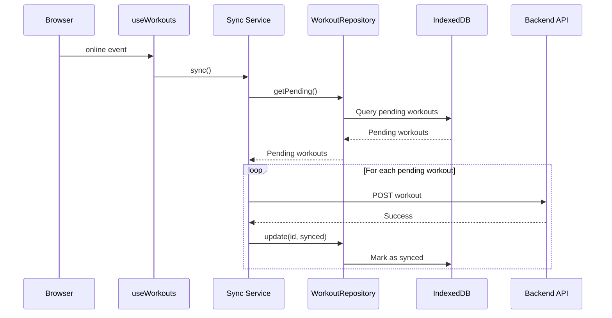

---

# 11. Synchronization Architecture

Synchronization is currently implemented in:

```text
services/sync.ts
```

Main functions:

```ts
syncWorkout()
syncPendingWorkouts()
syncWorkoutsFromServer()
```

The synchronization layer sits between local persistence and the remote API.

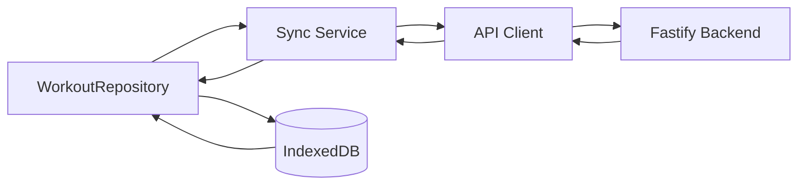

---

# 12. Pending Workout Synchronization

Pending workouts are retrieved from IndexedDB using their local synchronization status.

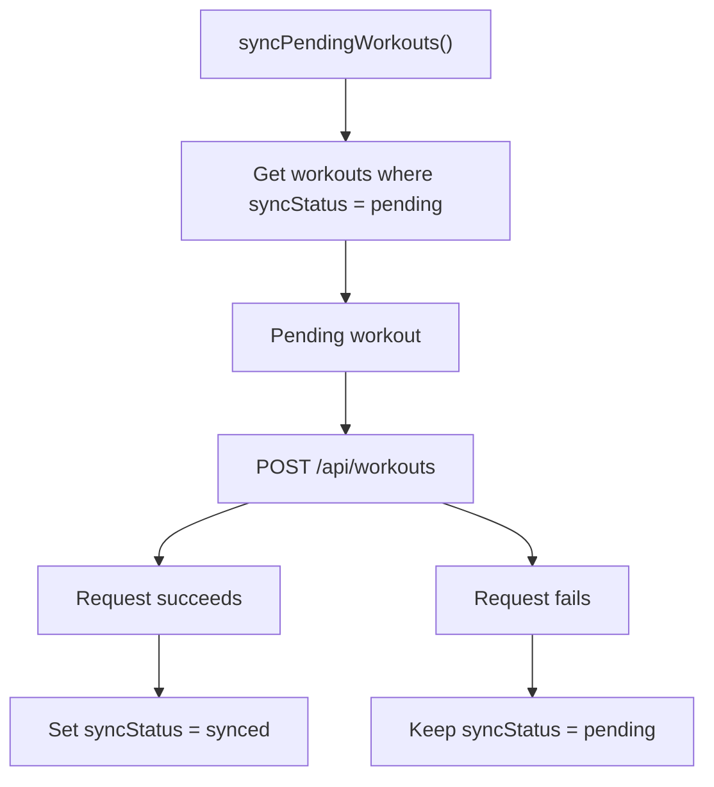

Failed workouts remain pending and can be retried during a future synchronization.

---

# 13. Synchronization From the Server

The frontend can retrieve workouts from the backend using:

```http
GET /api/workouts
```

The returned workouts are stored locally.

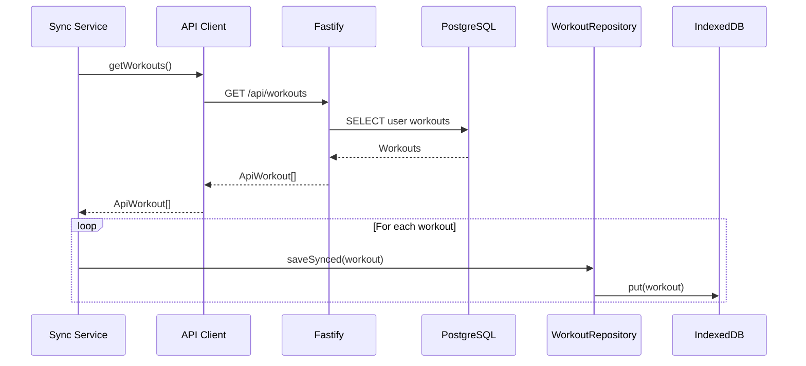

---

# 14. Frontend API Layer

The current API layer is located in:

```text
api/workouts.ts
```

It currently exposes:

```ts
createWorkout()
getWorkouts()
```

The API layer is responsible for:

* constructing HTTP requests;
* adding authentication headers;
* handling HTTP errors;
* converting HTTP responses to application objects.

Current dependency direction:

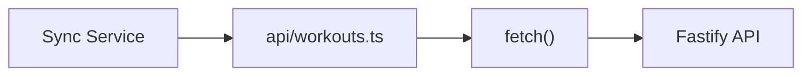

---

# 15. Backend Architecture

The backend currently uses Fastify.

Current structure:

```text
backend/src/

├── server.ts
├── db.ts
├── middleware/
│   └── auth.ts
└── routes/
    ├── auth.ts
    ├── users.ts
    └── workouts.ts
```

The current request flow is:

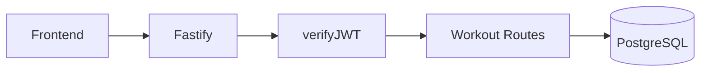

---

# 16. Workout API

The workout API currently exposes:

```http
POST /api/workouts
GET  /api/workouts
```

Both endpoints are protected by JWT authentication.

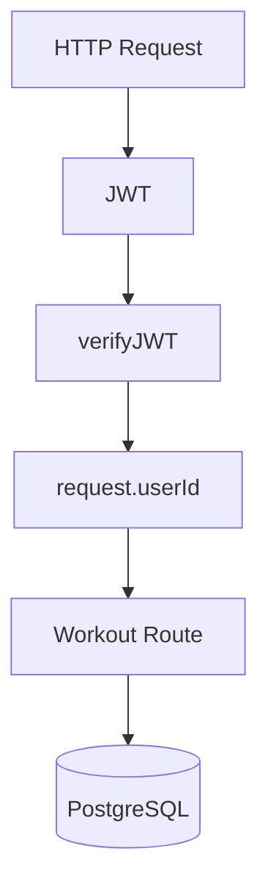

The server obtains the user ID from the authenticated token rather than trusting a `userId` supplied by the client.

---

# 17. Backend Workout Creation

The current backend flow is:

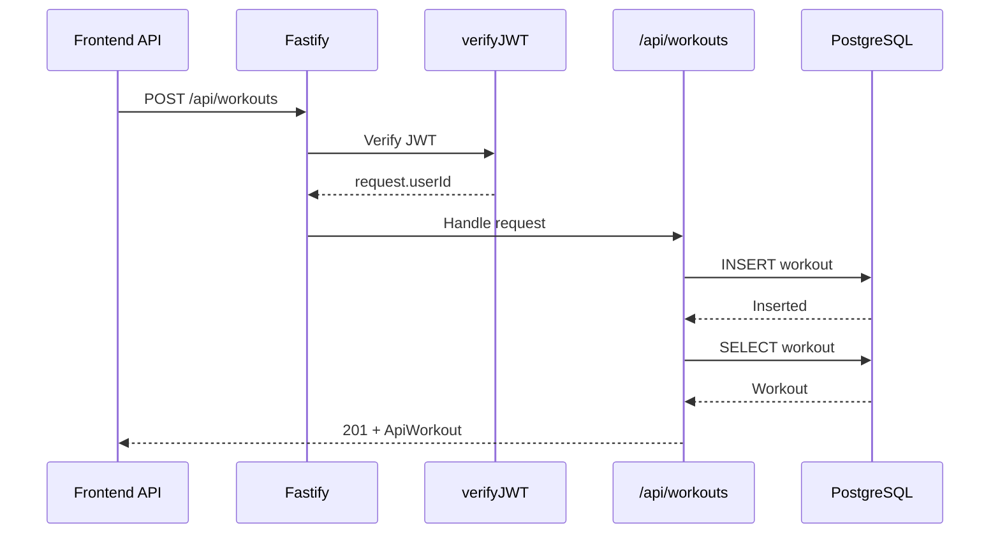

---

# 18. PostgreSQL Data Model

The current PostgreSQL database contains:

```text
users
user_devices
workouts
```

The main relationships are:

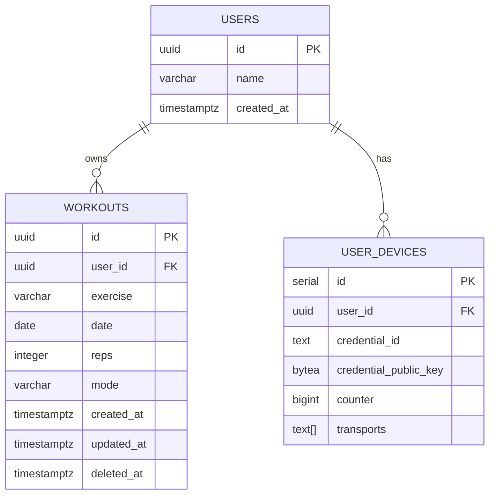

A workout belongs to exactly one user through:

```text
workouts.user_id → users.id
```

---

# 19. Workout Data Representations

A workout currently exists in several representations.

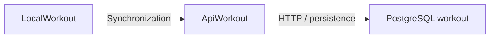

### Local representation

Used by IndexedDB:

```ts
LocalWorkout
```

It contains local metadata such as:

```ts
syncStatus
```

### API representation

Used by the HTTP API:

```ts
ApiWorkout
```

It additionally contains:

```ts
userId
```

### PostgreSQL representation

Stored in the `workouts` table.

---

# 20. Logout and Local Data

When the user logs out, the authentication store clears the authentication token and deletes the local workout database.

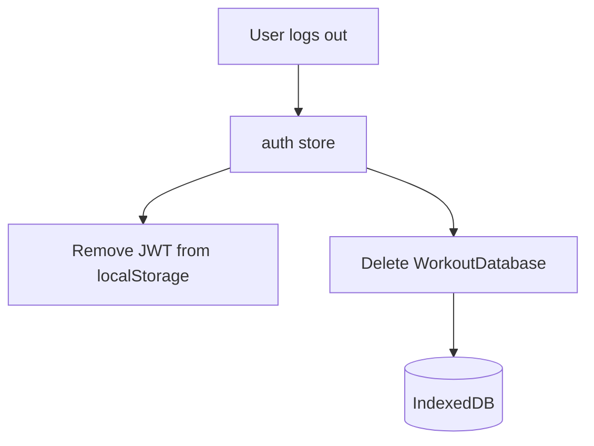

This prevents locally cached workout data from remaining on the device after logout.

---

# 21. Current Architectural Boundaries

The current frontend architecture can be summarized as:

```mermaid
flowchart TD
    UI["Views / Components"]
    Application["Composables"]
    Local["WorkoutRepository"]
    Storage["IndexedDB"]
    Sync["Sync Service"]
    API["API Client"]
    Backend["Fastify Backend"]
    Database["PostgreSQL"]

    UI --> Application
    Application --> Local
    Local --> Storage

    Application --> Sync
    Sync --> Local
    Sync --> API

    API --> Backend
    Backend --> Database
```

The main boundaries are:

### UI boundary

Views and components should not directly access persistence or HTTP.

### Local persistence boundary

`WorkoutRepository` encapsulates IndexedDB/Dexie.

### Synchronization boundary

`Sync Service` coordinates local and remote data.

### API boundary

The API layer encapsulates HTTP communication.

### Backend boundary

Fastify routes authenticate requests and persist data in PostgreSQL.

---

# 22. Current Strengths

The current architecture already provides several useful properties.

## Offline-first persistence

A workout can be created without a network connection.

## Local-first user experience

The UI does not need to wait for the server before displaying the newly created workout.

## Local persistence abstraction

IndexedDB access is progressively isolated behind a repository.

## Server-side ownership

The backend determines the authenticated user from the JWT.

## Retry behavior

Failed synchronization does not delete the local workout.

## Clear frontend responsibilities

The application is beginning to separate:

```text
UI
Application logic
Persistence
Synchronization
HTTP
```

---

# 23. Current Limitations

The architecture is functional, but several areas are still intentionally simple.

## Synchronization

The current synchronization mechanism:

* retrieves all workouts from the server;
* does not currently use `syncState.lastSync`;
* has no explicit conflict resolution strategy;
* has no versioning mechanism;
* has no dedicated outbox abstraction;
* does not distinguish all retryable and permanent errors.

## API layer

The API layer currently uses `fetch()` directly.

There is not yet a shared HTTP client responsible for common concerns such as:

* authentication;
* error normalization;
* request handling;
* retries;
* network detection.

## Backend

Workout routes currently combine:

* HTTP request handling;
* request extraction;
* SQL queries;
* response mapping.

There is not yet a dedicated backend service/repository layer.

## Domain model

`LocalWorkout`, `ApiWorkout`, and the PostgreSQL representation remain relatively close to each other.

There is not yet a strongly separated domain model.

---

# 24. Current Architecture at a Glance

The complete current architecture can be represented as:

```mermaid
flowchart TB
    subgraph Client["Client — Vue 3"]
        Views["Views"]
        Components["Components"]
        Composables["Composables"]
        Stores["Pinia Stores"]
        Repository["WorkoutRepository"]
        IndexedDB[(IndexedDB)]
        Sync["Sync Service"]
        API["API Client"]
        LocalStorage[(localStorage)]
    end

    subgraph Server["Server — Fastify"]
        JWT["JWT Middleware"]
        Routes["HTTP Routes"]
        ServerDB["Database Access"]
    end

    PostgreSQL[(PostgreSQL)]

    Views --> Components
    Views --> Composables
    Components --> Stores
    Composables --> Repository
    Repository --> IndexedDB

    Composables --> Sync
    Sync --> Repository
    Sync --> API

    Stores --> LocalStorage
    API --> JWT
    JWT --> Routes
    Routes --> ServerDB
    ServerDB --> PostgreSQL
```

---

# 25. Architectural Direction

The current architecture should be considered a **working intermediate architecture**, rather than a final target architecture.

The introduction of the `WorkoutRepository` is an important first step because it establishes a clear boundary around local persistence.

Possible future improvements include:

```mermaid
flowchart LR
    Current["Current Architecture"]

    HTTP["Shared HTTP Client"]
    SyncEngine["Dedicated Sync Engine"]
    Incremental["Incremental Synchronization"]
    Outbox["Explicit Outbox"]
    Conflict["Conflict / Version Handling"]
    BackendServices["Backend Service / Repository Layers"]

    Current --> HTTP
    HTTP --> SyncEngine
    SyncEngine --> Incremental
    Incremental --> Outbox
    Outbox --> Conflict
    Conflict --> BackendServices
```

These elements are **not yet implemented** and should be introduced incrementally as the application grows.

---

# 26. Architectural Principle

The most important architectural principle of CountRep is:

```text
                    ┌───────────────┐
                    │      UI       │
                    └───────┬───────┘
                            │
                            ▼
                    ┌───────────────┐
                    │   Application │
                    │     Logic     │
                    └───────┬───────┘
                            │
                            ▼
                    ┌───────────────┐
                    │     Local     │
                    │   Repository  │
                    └───────┬───────┘
                            │
                            ▼
                    ┌───────────────┐
                    │   IndexedDB   │
                    └───────────────┘

                       ↑
                       │
                 Synchronization
                       │
                       ▼

                    ┌───────────────┐
                    │     API       │
                    └───────┬───────┘
                            │
                            ▼
                    ┌───────────────┐
                    │    Fastify    │
                    └───────┬───────┘
                            │
                            ▼
                    ┌───────────────┐
                    │  PostgreSQL   │
                    └───────────────┘
```

The local database is therefore not merely a cache.

It is an important part of the application's operational data flow.

The server acts as the persistent shared backend, while the client maintains a locally usable representation that can continue to operate without connectivity.
